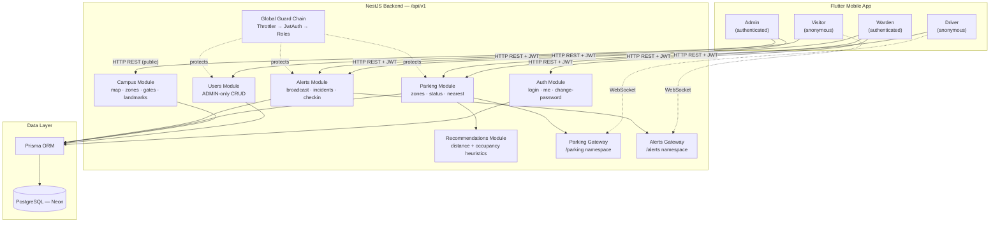
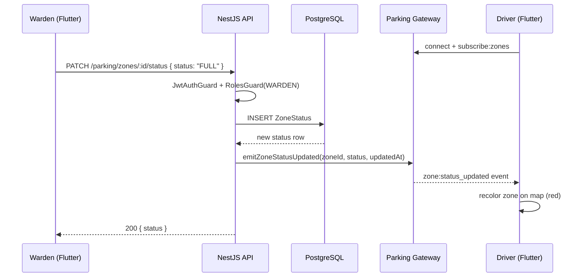
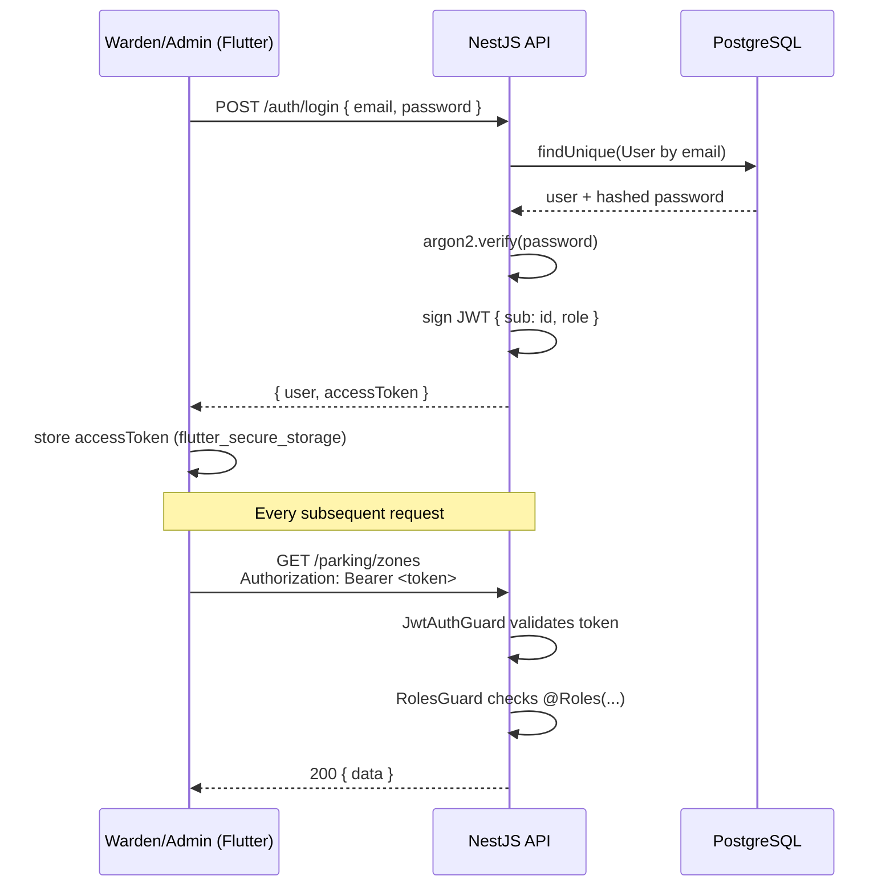
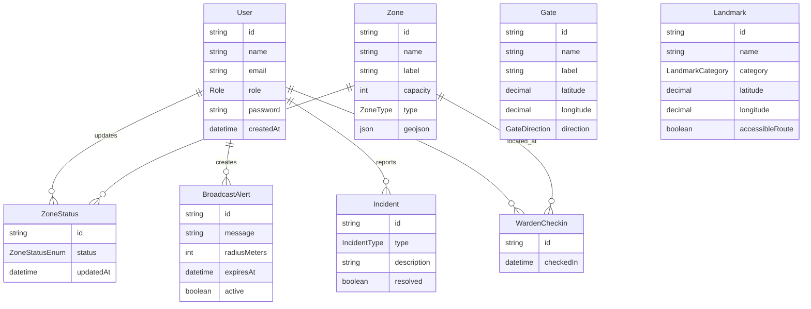

# SCMS — System Architecture

> Smart Campus Mobility System · Kingdom Hack 3.0 · Smart City Innovation Track

## 1. High-Level System Diagram

## 2. Real-Time Flow — Warden Marks a Zone Full

This is the core MVP demo flow: a warden updates a zone's status, and every connected
client sees the change within seconds, with no manual refresh.

## 3. Auth Flow

## 4. Data Model

## 5. Stack Summary

| Layer | Technology |
|-------|-----------|
| Mobile app | Flutter, Riverpod, GoRouter, Dio, Mapbox GL, Socket.IO client |
| API | NestJS 11, class-validator, Passport JWT, argon2 |
| Real-time | Socket.IO (`/parking`, `/alerts` namespaces) |
| Database | PostgreSQL (Neon, serverless) via Prisma ORM |
| Recommendation logic | Plain TypeScript heuristics (Haversine distance + occupancy-by-status scoring) — no separate ML service |

## 6. Key Design Decisions

- **No `VISITOR` role** — visitors and drivers are fully anonymous; only `WARDEN` and `ADMIN`
  have accounts, since they're vetted campus staff.
- **No public signup** — admin provisions warden accounts through `POST /users`.
- **Response envelope** — every API response is `{ success, message, data, error, timestamp }`,
  enforced globally via `TransformInterceptor` and `HttpExceptionFilter`.
- **ADMIN bypasses all role checks** — any route gated by `@Roles(WARDEN)` is also reachable
  by an `ADMIN` token.
- **JWT in response body, not a cookie** — Flutter can't read httpOnly cookies, so the access
  token is returned in the JSON body and stored client-side via `flutter_secure_storage`.
